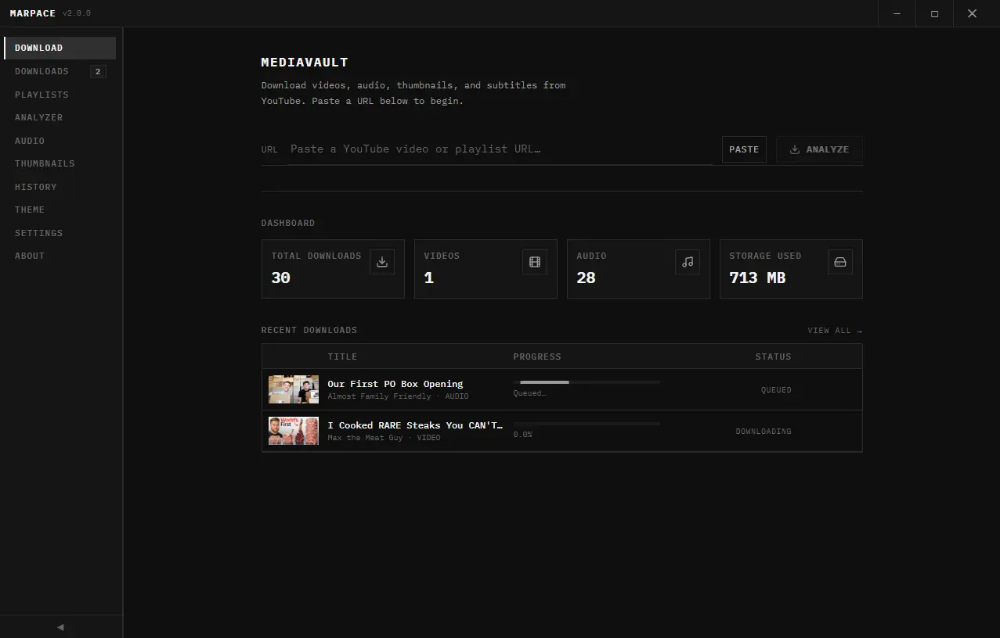

<p align="center">

</p>

<h1 align="center">MediaVault</h1>

<p align="center"><em>Download. Analyze. Manage.</em></p>

<p align="center">
Made to free y'all from the hassle of jumping between sketchy sites that hardly work. Everything you need for YouTube downloading, all in one place. Built with love by marpace <3
</p>

MediaVault is a cross-platform desktop app built to make downloading YouTube videos, audio, thumbnails, subtitles, and entire playlists completely painless. It's powered by yt-dlp and FFmpeg

Under the hood, it's an Electron + React + TypeScript app styled with TailwindCSS and animated with Framer Motion. It uses better-sqlite3 for local download history and features a robust background download manager—packing a real queue, concurrency control, pause/resume/cancel/retry, live progress, and graceful error recovery.

<p align="center">

</p>

## ✨ Features

| Area | Highlights |
|------|-----------|
| **Video** | 144p → 2160p (4K) + *Best Available*, MP4 / MKV output, automatic FFmpeg muxing |
| **Audio** | MP3, M4A, AAC, WAV, FLAC, OGG · 128 / 192 / 256 / 320 kbps · *Best* |
| **Thumbnails** | Every available resolution with dimensions + lightbox preview & one-click download |
| **Subtitles** | SRT / VTT / TXT, human + auto-generated, multi-language |
| **Analytics** | Views, likes, comments, subs, tags, category, language, live/age status, formats, tracks |
| **Playlists** | Full or hand-picked downloads, bulk video/audio with one quality selection |
| **Download Manager** | Queue, concurrency limit, pause/resume/cancel/retry, speed + ETA, search/filter/sort |
| **Smart** | Clipboard URL detection, drag & drop, paste button, URL validation, duplicate detection |
| **UX** | Dark/Light/System themes, glassmorphism, Framer Motion transitions, skeletons, toasts, context menus |
| **Platform** | Windows (NSIS), macOS (DMG/ZIP), Linux (AppImage/deb), auto-updater |

---

##  Quick start (development)

```bash
# 1. Install dependencies
npm install

# 2. (Optional) rebuild native modules for Electron's ABI
npm run rebuild

# 3. Make sure yt-dlp and ffmpeg are available
#    - either on your system PATH, or
#    - fetched into resources/bin via:  npm run fetch-binaries
#    - or set custom paths later in Settings → Engine status

# 4. Start the app in dev mode (Vite + Electron with HMR)
npm run dev
```

> **Engines:** MediaVault looks for `yt-dlp` and `ffmpeg` in this order:
> 1. Custom path set in **Settings**
> 2. Bundled binary in `resources/bin/<platform>`
> 3. System `PATH`
>
> If neither is found, a warning banner appears on the Home screen linking to Settings.

---

## 📦 Production build

```bash
# Fetch bundled binaries for the target platform (recommended)
npm run fetch-binaries          # current OS
# npm run fetch-binaries:all    # yt-dlp for all OSes

# Build installers
npm run build         # current platform
npm run build:win     # Windows x64 NSIS installer
npm run build:mac     # macOS DMG + ZIP
npm run build:linux   # Linux AppImage + deb
```

Output is written to `release/<version>/`. See **[BUILD.md](./BUILD.md)** for full
details (code signing, FFmpeg bundling, auto-updater publishing).

---

##  Project structure

```
mediavault/
├── electron/                 # Main process (Node side)
│   ├── main/                 #   app entry + IPC registration
│   ├── preload/              #   secure context-bridge API
│   ├── services/             #   yt-dlp, download manager, settings, deps, updater
│   ├── db/                   #   SQLite (better-sqlite3) persistence
│   └── utils/                #   binaries resolver, validation, errors, logger
├── shared/                   # Types shared by main + renderer (single source of truth)
├── src/                      # Renderer (React)
│   ├── components/           #   reusable UI + video/ panels
│   ├── pages/                #   Home, Video, Downloads, Playlists, Audio, Thumbnails, Analytics, Settings
│   ├── store/                #   Zustand stores (settings, downloads, ui)
│   ├── hooks/                #   useAnalyze
│   ├── lib/                  #   formatters, option lists, helpers
│   └── styles/               #   Tailwind + design tokens
├── build/                    # electron-builder resources (icons, entitlements)
├── resources/bin/<os>/       # bundled yt-dlp / ffmpeg (gitignored)
└── scripts/                  # fetch-binaries helper

structure generated with help of ai-
```
---
---

## Acknowledgements

MediaVault would not be possible without the work of the open-source community and the maintainers of:

* Electron
* React
* TypeScript
* TailwindCSS
* Framer Motion
* yt-dlp
* FFmpeg
* better-sqlite3

---

## Support

If you run into issues, have suggestions, or would like to contribute:

**Discord Server**
https://discord.gg/PJp2uA9xt7

**Discord**
marpaceamv

**Email**
[marpaceamv@gmail.com](mailto:marpaceamv@gmail.com)

**YouTube**
https://www.youtube.com/@marpace1

---

---

##  Security model

- **contextIsolation: true**, **nodeIntegration: false** — the renderer never
  touches Node directly.
- A typed **preload bridge** exposes only a minimal, audited API surface.
- Strict **Content-Security-Policy** in `index.html`.
- All URLs are validated + normalised in the main process before reaching any
  child process (no shell, `execFile`/`spawn` with explicit args — no injection).
- Filenames are sanitised cross-platform.
- External links open in the system browser, never in-app.

---

## 📄 License

MIT — see source headers. yt-dlp and FFmpeg are separate projects under their own
licenses; bundle them in accordance with those licenses.


